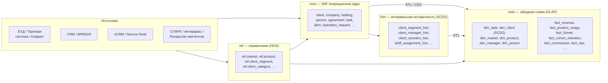
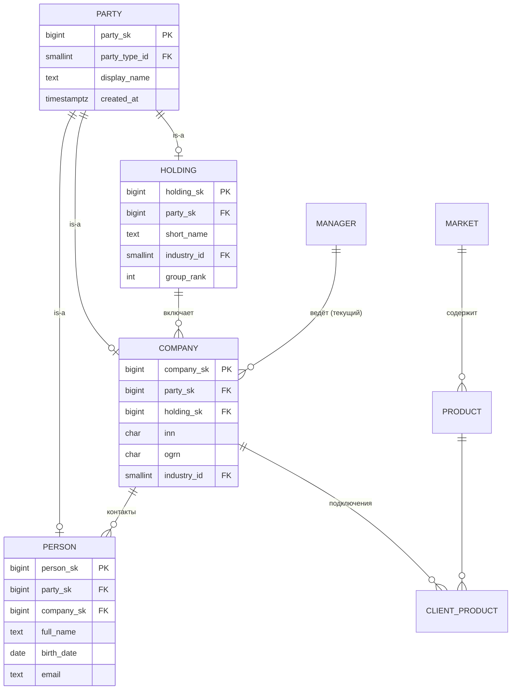
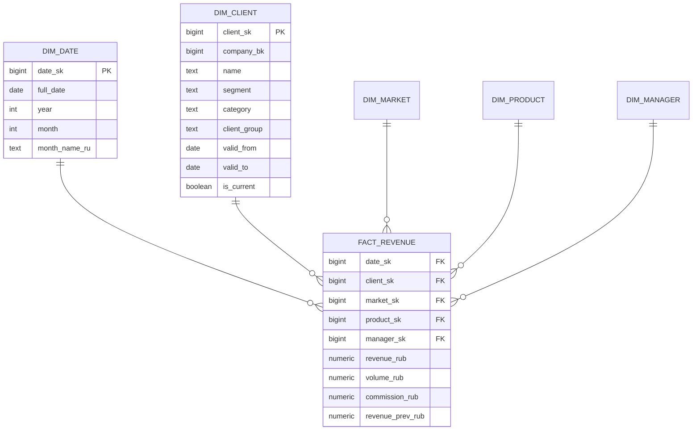

# Модель данных aCRM — проектное решение

> Аналитический CRM Группы «Московская Биржа». Документ описывает целевую модель
> данных для промышленной системы на основе прототипа `acrm_se`.
> Диалект DDL — **PostgreSQL 15+** (для аналитического слоя допустима выгрузка в
> ClickHouse / Greenplum; отличия отмечены).

**Автор роли:** ведущий инженер БД
**Статус:** проектное предложение (target data model)

---

## 1. Цель и принципы проектирования

Система обслуживает два принципиально разных класса нагрузки, поэтому модель
**трёхслойная** — это осознанное архитектурное решение, а не дублирование:

| Слой | Назначение | Нагрузка | Нормализация |
|------|-----------|----------|--------------|
| **`ref`** — справочники | НСИ, перечисления, каталоги | справочное чтение | 3NF, редко меняется |
| **`core`** — операционное ядро | ввод/изменение данных (aCRM/oCRM) | OLTP, точечные записи | **3NF / BCNF** |
| **`hist`** — историчность | версии редкоменяющихся атрибутов | append-only | 6NF-подобно, интервалы |
| **`mart`** — витрина | дашборды, воронки, рэнкинги, AI | OLAP, агрегаты | **звезда (star schema)** |

Принципы, которые заложены в модель:

1. **Нормализация ядра до 3NF/BCNF.** Устраняем транзитивные зависимости и
   дублирование, которые есть в прототипе (см. §3.1). Каждый факт хранится
   ровно один раз.
2. **Справочники вместо enum'ов и «магических строк».** Все перечисления из кода
   (`ClientSegment`, `Market`, `AlertSeverity`, `ProductStatus`, …) выносятся в
   таблицы-справочники с суррогатным ключом и стабильным бизнес-кодом.
3. **Историчность редкоменяющихся параметров в интервальном формате.**
   Сегмент, категория, закрепление менеджера, категория клиринга, санкции,
   тариф и т. п. хранятся с интервалом действия `[valid_from, valid_to)` и
   защитой от пересечений. Это SCD Type 2 на уровне отдельных атрибутов.
4. **Звёздная схема для аналитики.** Быстро меняющиеся величины (обороты, доход,
   комиссия, NPS, воронка) — это **факты**, окружённые конформными
   **измерениями**. Измерение клиента — SCD2.
5. **Суррогатные ключи** (`*_sk`, `bigint identity`) во всех таблицах; бизнес-ключи
   (`inn`, `ogrn`, код рынка) — как `UNIQUE`-атрибуты, а не PK.
6. **Мягкое удаление и аудит** (`created_at`, `updated_at`, `source_system`) — данные
   приходят из нескольких систем (ЕХД, CRM, oCRM, Service Desk, СПАРК).

---

## 2. Общая архитектура



Правила потоков:
- `ref` наполняется НСИ-процессами и используется и ядром, и витриной (конформные измерения).
- `core` — единственный источник истины для операционных данных.
- `hist` строится триггерами/CDC поверх `core`: при изменении отслеживаемого
  атрибута предыдущая версия «закрывается» (`valid_to`), создаётся новая.
- `mart` пересобирается ETL (батч ночью + микробатч для оперативных дашбордов).

---

## 3. Нормализованное ядро (`core`, 3NF)

### 3.1 Что нормализуем относительно прототипа

В прототипе данные денормализованы (это нормально для мока, но недопустимо в БД):

| Проблема в прототипе | Нарушение | Решение в модели |
|----------------------|-----------|------------------|
| `Company.managerName` рядом с `managerId` | транзитивная зависимость (3NF) | хранить только FK `manager_sk`; имя — в `core.manager` |
| `Company.holdingName`, `Person.companyName/holdingName` | дублирование | только FK, имена — join |
| `Company.activeProducts: string[]`, `inactiveProducts: string[]` | нарушение 1NF (мультизначный атрибут) | связь M:N `core.client_product` со статусом |
| `Company.markets: Market[]`, `Person.industryCommittees: string[]`, `tags[]` | 1NF | bridge-таблицы |
| `Alert.entityId + entityType` (полиморфизм) | ссылочная целостность не гарантируется | раздельные FK + `CHECK`, либо supertype `core.party` |
| `ClientRecord` vs `HeatClient` vs `ClientRankRow` — три представления клиента | избыточность | один `core.client` + факты/историчность |
| `Holding.revenueYTD`, `healthScore`, … хранятся в сущности | смешение фактов и справочных данных | вынести в `mart.fact_*` и `core`-скоры отдельно |

### 3.2 Supertype «Party» и иерархия клиента

Холдинг → Компания (юр. лицо) → конечные клиенты образуют иерархию. Физлица тоже
клиенты. Вводим обобщённую сущность **`core.party`** (контрагент) и специализации.



> **Почему supertype.** Алерты, задачи, договоры, новости в прототипе ссылаются на
> «сущность любого типа» (`entityType ∈ holding|company|person|product`). Вместо
> хрупкого полиморфизма делаем единый `party_sk`, на который ссылаются все
> «прикрепляемые» объекты — ссылочная целостность сохраняется одним FK.

### 3.3 Ключевые таблицы ядра (DDL, фрагмент)

```sql
-- ============ ОБОБЩЁННЫЙ КОНТРАГЕНТ ============
create table core.party (
    party_sk        bigint generated always as identity primary key,
    party_type_id   smallint not null references ref.party_type(party_type_id),
    display_name    text     not null,
    source_system   text     not null default 'ЕХД',
    created_at      timestamptz not null default now(),
    updated_at      timestamptz not null default now()
);

-- ============ ХОЛДИНГ (группа клиентов) ============
create table core.holding (
    holding_sk   bigint generated always as identity primary key,
    party_sk     bigint not null unique references core.party(party_sk),
    short_name   text,
    industry_id  smallint references ref.industry(industry_id),
    group_rank   int
    -- segment/category/activity_status — историчны, см. hist.* (§4)
);

-- ============ КОМПАНИЯ (юр. лицо / клиент) ============
create table core.company (
    company_sk    bigint generated always as identity primary key,
    party_sk      bigint not null unique references core.party(party_sk),
    holding_sk    bigint references core.holding(holding_sk),
    inn           varchar(12) not null,
    ogrn          varchar(15),
    industry_id   smallint references ref.industry(industry_id),
    end_clients_count int,
    constraint uq_company_inn unique (inn)
    -- segment/category/manager/clearing_category — историчны, см. hist.* (§4)
);

-- ============ ФИЗ. ЛИЦО / КОНТАКТ ============
create table core.person (
    person_sk     bigint generated always as identity primary key,
    party_sk      bigint not null unique references core.party(party_sk),
    company_sk    bigint references core.company(company_sk),
    full_name     text not null,
    first_name    text,
    last_name     text,
    birth_date    date,
    email         citext,
    phone         text,
    assistant     text,
    department    text,
    -- title/personRole/influenceLevel/vip — историчны (карьера меняется), см. §4
    public_speaking boolean default false,
    manager_notes text
);

-- ============ МЕНЕДЖЕР (владелец портфеля) ============
create table core.manager (
    manager_sk  bigint generated always as identity primary key,
    manager_bk  text not null unique,        -- 'mgr1'
    full_name   text not null,
    role_id     smallint references ref.user_role(role_id)
);

-- ============ КАТАЛОГ ПРОДУКТОВ (snowflake к рынку) ============
create table core.product (
    product_sk  bigint generated always as identity primary key,
    market_id   smallint not null references ref.market(market_id),
    code        text not null,               -- 'eq1', 'der1'
    name        text not null,               -- 'Акции', 'Фьючерсы'
    constraint uq_product unique (market_id, name)
);

-- ============ M:N ПОДКЛЮЧЕНИЕ КЛИЕНТА К ПРОДУКТУ (снимает 1NF-нарушение) ==
create table core.client_product (
    company_sk        bigint not null references core.company(company_sk),
    product_sk        bigint not null references core.product(product_sk),
    connected_date    date,
    status_id         smallint references ref.product_status(status_id),
    is_connected      boolean not null default false,
    is_active         boolean not null default false,
    primary key (company_sk, product_sk)
);

-- ============ ЛЮДИ ↔ ОТРАСЛЕВЫЕ КОМИТЕТЫ (1NF для industryCommittees) ====
create table core.person_committee (
    person_sk    bigint not null references core.person(person_sk),
    committee_id smallint not null references ref.committee(committee_id),
    primary key (person_sk, committee_id)
);

-- ============ ВСТРЕЧИ / КОММУНИКАЦИИ ============
create table core.meeting (
    meeting_sk  bigint generated always as identity primary key,
    company_sk  bigint references core.company(company_sk),
    meeting_date date not null,
    topic       text,
    outcome     text,
    next_steps  text
);
create table core.meeting_participant (          -- 1NF для participants[]
    meeting_sk bigint references core.meeting(meeting_sk),
    person_sk  bigint references core.person(person_sk),
    ext_name   text,                             -- внешний участник без карточки
    primary key (meeting_sk, person_sk)
);

-- ============ АЛЕРТ (через party_sk вместо полиморфизма) ============
create table core.alert (
    alert_sk        bigint generated always as identity primary key,
    party_sk        bigint not null references core.party(party_sk),
    alert_type_id   smallint not null references ref.alert_type(alert_type_id),
    severity_id     smallint not null references ref.alert_severity(severity_id),
    status_id       smallint not null references ref.alert_status(status_id),
    title           text not null,
    description     text,
    source_id       smallint references ref.source_system(source_id),
    recommended_action text,
    responsible_sk  bigint references core.manager(manager_sk),
    detected_at     timestamptz not null,
    resolved_at     timestamptz
);

-- ============ ЗАДАЧА ============
create table core.task (
    task_sk       bigint generated always as identity primary key,
    party_sk      bigint references core.party(party_sk),
    task_type_id  smallint not null references ref.task_type(task_type_id),
    priority_id   smallint not null references ref.priority(priority_id),
    status_id     smallint not null references ref.task_status(status_id),
    title         text not null,
    description   text,
    assignee_sk   bigint references core.manager(manager_sk),
    due_date      date,
    created_at    timestamptz not null default now(),
    completed_at  timestamptz
);

-- ============ ДОГОВОР / ДОКУМЕНТ (интервал действия — естественно historized) =
create table core.agreement (
    agreement_sk     bigint generated always as identity primary key,
    party_sk         bigint not null references core.party(party_sk),
    agreement_type_id smallint not null references ref.agreement_type(agreement_type_id),
    title            text not null,
    signed_date      date not null,
    expires_date     date,
    responsible_sk   bigint references core.manager(manager_sk),
    valid_period     daterange generated always as
                       (daterange(signed_date, expires_date, '[]')) stored
);
create table core.agreement_task (                -- linkedTasks[] → 1NF
    agreement_sk bigint references core.agreement(agreement_sk),
    task_sk      bigint references core.task(task_sk),
    primary key (agreement_sk, task_sk)
);

-- ============ ОБРАЩЕНИЕ oCRM ============
create table core.operation_request (
    request_sk     bigint generated always as identity primary key,
    request_no     text not null unique,          -- 'REQ-2026-4821'
    party_sk       bigint references core.party(party_sk),
    op_type_id     smallint not null references ref.operation_type(op_type_id),
    priority_id    smallint not null references ref.priority(priority_id),
    status_id      smallint not null references ref.operation_status(status_id),
    department_id  smallint references ref.department(department_id),
    assignee       text,
    title          text,
    description    text,
    sla_hours      int,
    created_at     timestamptz not null,
    updated_at     timestamptz
);
```

*(Новости, стратегические инициативы, возможности роста, когорты, участие в
мероприятиях моделируются аналогично — через `party_sk` + FK на справочники;
DDL опущен для краткости, состав атрибутов — в §7.)*

---

## 4. Историчность редкоменяющихся параметров (интервальный формат)

### 4.1 Идея

Часть атрибутов **меняется редко, но важна их история**: на какую дату у клиента
был сегмент STRATEGIC, кто вёл клиента в марте, когда действовали санкции, по
какому тарифу он обслуживался. Хранить это как обычный столбец нельзя — потеряем
прошлое. Хранить в фактовой таблице «на каждый день» — расточительно
(значение месяцами одно и то же).

**Решение — интервальное версионирование (SCD Type 2 на уровне атрибута):**
каждая версия занимает полуинтервал `[valid_from, valid_to)` (closed-open).
Открытая версия имеет `valid_to = 'infinity'` и `is_current = true`.

```
Компания «ВТБ Капитал», атрибут «сегмент»:

 STRATEGIC  ├──────────────────────────────►  (valid_to = infinity, is_current)
            2019-01-01
 PREMIUM    ├───────────┤
            2017-05-01  2019-01-01

Смежные интервалы не пересекаются и не имеют разрывов (gap-free).
```

### 4.2 Общий паттерн таблицы-истории

```sql
-- Пример: история сегмента клиента
create table hist.company_segment (
    hist_sk     bigint generated always as identity primary key,
    company_sk  bigint  not null references core.company(company_sk),
    segment_id  smallint not null references ref.client_segment(segment_id),
    valid_from  date    not null,
    valid_to    date    not null default 'infinity',
    is_current  boolean generated always as (valid_to = 'infinity') stored,
    source_system text  not null default 'ЕХД',
    recorded_at timestamptz not null default now(),

    -- 1) интервал корректен
    constraint chk_period check (valid_from < valid_to),
    -- 2) у одной компании интервалы НЕ ПЕРЕСЕКАЮТСЯ (ключевая гарантия!)
    constraint no_overlap
        exclude using gist (
            company_sk with =,
            daterange(valid_from, valid_to, '[)') with &&
        )
);
create index on hist.company_segment (company_sk) where is_current;
```

`EXCLUDE USING gist … WITH &&` — это то, что отличает «взрослую» реализацию:
СУБД физически не даст вставить пересекающийся интервал. (Требует
`CREATE EXTENSION btree_gist;`.)

### 4.3 Какие атрибуты выносим в `hist` (реестр редкоменяющихся параметров)

| Таблица истории | Атрибут | Справочник | Причина историчности |
|-----------------|---------|-----------|----------------------|
| `hist.company_segment` | сегмент | `ref.client_segment` | ре-сегментация клиента |
| `hist.company_category` | категория | `ref.client_category` | смена типа контрагента |
| `hist.company_group` | группа (Банк/Брокер/…) | `ref.client_group` | реклассификация |
| `hist.company_clearing_cat` | категория клиринга Б/Б2/В | `ref.clearing_category` | решение НКЦ |
| `hist.company_manager` | закреплённый КМ | `core.manager` | ротация менеджеров |
| `hist.company_holding` | принадлежность холдингу | `core.holding` | M&A, реструктуризация |
| `hist.company_activity_status` | active/declining/… | `ref.activity_status` | пересчёт активности |
| `hist.party_sanction` | санкции/ограничения | `ref.restriction_type` | вводятся/снимаются на период |
| `hist.tariff_assignment` | тарифный план | `ref.tariff` | пролонгация/смена тарифа |
| `hist.person_position` | должность+компания+отдел | — | смена работы |
| `hist.person_influence` | уровень влияния / роль ЛПР | `ref.influence_level`, `ref.person_role` | карьерный рост |
| `hist.company_scores` | health / risk / growth (бэндами) | — | скоринг меняется дискретно |

> **Санкции** — показательный кейс: это не флаг, а **интервал** (введены →
> действуют → сняты). Одна компания может иметь несколько типов ограничений
> одновременно, поэтому в `hist.party_sanction` в exclusion-ограничение
> добавляется `restriction_type_id WITH =` (пересечения запрещены только внутри
> одного типа).

```sql
create table hist.party_sanction (
    hist_sk           bigint generated always as identity primary key,
    party_sk          bigint not null references core.party(party_sk),
    restriction_type_id smallint not null references ref.restriction_type(restriction_type_id),
    valid_from        date not null,
    valid_to          date not null default 'infinity',
    is_current        boolean generated always as (valid_to = 'infinity') stored,
    constraint chk_s check (valid_from < valid_to),
    constraint no_overlap_same_type
        exclude using gist (
            party_sk with =,
            restriction_type_id with =,
            daterange(valid_from, valid_to, '[)') with &&
        )
);
```

### 4.4 Типовые операции

**Закрытие текущей версии и открытие новой (изменение сегмента):**
```sql
begin;
update hist.company_segment
   set valid_to = date '2026-07-01'
 where company_sk = :c and valid_to = 'infinity';

insert into hist.company_segment (company_sk, segment_id, valid_from)
values (:c, :new_segment_id, date '2026-07-01');
commit;
```

**Срез «как было на дату» (temporal as-of query):**
```sql
select c.inn, s.segment_id
from core.company c
join hist.company_segment s
  on s.company_sk = c.company_sk
 and daterange(s.valid_from, s.valid_to, '[)') @> date '2026-03-15';
```

**Текущее значение (горячий путь для UI):**
```sql
select segment_id from hist.company_segment
where company_sk = :c and is_current;
```

> При необходимости аудита («когда мы *узнали* об изменении», а не «когда оно
> *произошло*») паттерн расширяется до **битемпорального**: добавляем вторую пару
> `system_from/system_to`. В целевой версии — по требованию комплаенса.

---

## 5. Слой справочников (`ref`)

Все перечисления кода становятся справочниками. Единый шаблон:

```sql
create table ref.client_segment (
    segment_id  smallint primary key,     -- стабильный технический ключ
    code        text not null unique,     -- 'STRATEGIC'
    name_ru     text not null,            -- 'Стратегический'
    sort_order  smallint,
    is_active   boolean not null default true
);
```

### 5.1 Реестр справочников (маппинг enum → таблица)

| Справочник | Источник (enum в коде) | Значения (код) |
|-----------|------------------------|----------------|
| `ref.party_type` | — | holding, company, person |
| `ref.user_role` | `UserRole` | ceo, block_head, market_lead, manager, operations |
| `ref.access_level` | `AccessLevel` | 6…0 (интервал уровней доступа) |
| `ref.client_segment` | `ClientSegment` | PREMIUM, STANDARD, SME, INSTITUTIONAL, RETAIL, STRATEGIC |
| `ref.client_category` | `ClientCategory` | BROKER, BANK, INSURANCE, PENSION_FUND, ASSET_MANAGER, CORPORATION, STATE, FOREIGN |
| `ref.client_group` | `ClientGroup` | Банк, Брокер, Корпорат, Нерезидент, УК |
| `ref.clearing_category` | `ClearingCategory` | Б, Б2, В |
| `ref.market` | `Market` | equity, derivatives, fx, money, commodity, clearing, depository, info, tech |
| `ref.product_status` | `ProductStatus` | Подключен, Активно торгует, Перспективный, Нет интереса, Подключен к бою, Нет статуса, Не торгует, Низкая активность |
| `ref.activity_status` | `ActivityStatus` | active, declining, inactive, new |
| `ref.alert_severity` | `AlertSeverity` | critical, high, medium, low |
| `ref.alert_status` | `AlertStatus` | new, in_progress, resolved |
| `ref.alert_type` | `Alert.type` | volume_decline, expiring_certificate, no_contact, expiring_tariff, inactive_product |
| `ref.alert_code` | `ClientAlertCode` | inactive, detractor, nps_drop, single_product, birthday, underplan |
| `ref.task_type` | `Task.type` | call, meeting, document, escalation, cross_sell, other |
| `ref.task_status` | `TaskStatus` | open, in_progress, done, overdue |
| `ref.priority` | Task/Operation priority | critical, high, medium, low |
| `ref.person_role` | `PersonRole` | decision_maker, influencer, sponsor, user, gatekeeper |
| `ref.influence_level` | `InfluenceLevel` | very_high, high, medium, low |
| `ref.agreement_type` | `Agreement.type` | contract, tariff, sla, key, certificate, protocol |
| `ref.agreement_status` | `Agreement.status` | active, expiring, expired |
| `ref.operation_type` | `OperationRequest.type` | request, incident, task, document |
| `ref.operation_status` | `OperationRequest.status` | new, in_progress, pending, resolved, overdue |
| `ref.department` | oCRM department | ИТ, Клиентский сервис, УКС, … |
| `ref.news_category` | `NewsItem.category` | market, company, regulatory, macro |
| `ref.relevance` | relevance | high, medium, low |
| `ref.sentiment` | sentiment | positive, neutral, negative |
| `ref.strategy_status` | `StrategyItem.status` | on_track, at_risk, behind, achieved |
| `ref.opportunity_type` | `GrowthOpportunity.type` | cross_sell, up_sell, reactivation, new_product |
| `ref.ai_insight_type` | `AIInsight.type` | summary, risk, opportunity, next_action, cross_sell, meeting_brief |
| `ref.invitation_status` | `EventParticipation.invitationStatus` | recommended, invited, confirmed, declined, attended |
| `ref.priority_level` | `EventParticipation.priorityLevel` | vip, high, medium, standard |
| `ref.funnel_stage` | воронка | views, leads, started, approved, first_commission |
| `ref.restriction_type` | санкции | Санкции, Отзыв лицензии |
| `ref.industry` | `industry` (строка) | Банковский сектор, Энергетика, … |
| `ref.committee` | `industryCommittees` | НАУФОР, ВЭФ, РСПП, … |
| `ref.source_system` | `Alert.source` | ЕХД, Service Desk, Биллинг, CRM, … |
| `ref.tariff` | тарифные планы | Premium 2026, Рыночные данные, … |

Справочник `ref.date` (календарь) описан в §6 как измерение витрины.

---

## 6. Аналитическая витрина (`mart`) — звёздная схема

Быстро меняющиеся величины — **факты**; контекст — **измерения**. Измерения
конформны (переиспользуются между фактами).

### 6.1 Диаграмма звезды (пример: доход)



### 6.2 Измерение клиента как SCD Type 2

В витрине измерение клиента **денормализовано и версионировано** — атрибуты,
которые в ядре лежат в `hist.*`, здесь «схлопываются» в версии строки `dim_client`.
Каждый факт ссылается на ту версию клиента, которая действовала на дату факта, —
это даёт корректный исторический срез в дашбордах без join'ов к `hist`.

```sql
create table mart.dim_client (
    client_sk      bigint generated always as identity primary key,  -- суррогат ВЕРСИИ
    company_bk     bigint not null,          -- бизнес-ключ (core.company_sk)
    inn            varchar(12),
    name           text,
    holding_name   text,
    segment        text,        -- на момент версии
    category       text,
    client_group   text,        -- Банк/Брокер/…
    clearing_cat   text,        -- Б/Б2/В
    manager_name   text,
    activity_status text,
    is_sanctioned  boolean,
    -- SCD2-атрибуты версии:
    valid_from     date not null,
    valid_to       date not null default 'infinity',
    is_current     boolean generated always as (valid_to = 'infinity') stored,
    version_no     int not null default 1
);
create unique index on mart.dim_client (company_bk) where is_current;
```

`dim_date`, `dim_market`, `dim_product`, `dim_manager`, `dim_person`,
`dim_funnel_stage` — обычные (SCD1/статичные) конформные измерения.

### 6.3 Каталог фактов

| Fact-таблица | Зерно (grain) | Меры | Тип |
|--------------|---------------|------|-----|
| `fact_revenue` | клиент × рынок × продукт × месяц | revenue_rub, volume_rub, commission_rub, *_prev | периодический снимок |
| `fact_product_usage` | клиент × продукт × месяц | volume, revenue, is_connected, is_active, status_id | снимок |
| `fact_commission_daily` | клиент × день | commission_mtd, commission_plan | транзакц./снимок |
| `fact_nps` | клиент × месяц | nps, nps_prev | снимок |
| `fact_funnel` | рынок × стадия воронки × месяц | reached_count, conversion_pct | периодический снимок |
| `fact_cohort_retention` | рынок × месяц-когорты × возраст (мес.) | retention_pct | снимок |
| `fact_market_trading` | рынок × сегмент (corp/retail) × месяц | trading_volume, adtv, active_clients, avg_revenue | снимок |
| `fact_plan` | (клиент|рынок) × период | revenue_target, volume_target, current_volume, gap, progress | целевые |
| `fact_opportunity` | клиент × продукт | potential_revenue, probability | pipeline |
| `fact_task` | задача (accumulating) | created→due→completed, lead_time | накопит. снимок |
| `fact_alert` | алерт (event) | detected_at, resolved_at, ttl | событийный |
| `fact_operation_request` | обращение (accumulating) | sla_hours, sla_remaining | накопит. снимок |
| `fact_interaction` | клиент/персона × дата | meeting_cnt, days_since_contact | событийный |

Пример DDL факта и «фактически бесфактовой» воронки:

```sql
create table mart.fact_revenue (
    date_sk        bigint not null references mart.dim_date(date_sk),
    client_sk      bigint not null references mart.dim_client(client_sk),
    market_sk      bigint not null references mart.dim_market(market_sk),
    product_sk     bigint references mart.dim_product(product_sk),
    manager_sk     bigint references mart.dim_manager(manager_sk),
    revenue_rub      numeric(18,2) not null default 0,
    volume_rub       numeric(20,2) not null default 0,
    commission_rub   numeric(18,2) not null default 0,
    revenue_prev_rub numeric(18,2) not null default 0,
    primary key (date_sk, client_sk, market_sk, product_sk)
);

create table mart.fact_funnel (
    date_sk        bigint not null references mart.dim_date(date_sk),
    market_sk      bigint not null references mart.dim_market(market_sk),
    stage_id       smallint not null references ref.funnel_stage(stage_id),
    reached_count  int not null,
    primary key (date_sk, market_sk, stage_id)
);
```

### 6.4 Bus-matrix (факты × измерения)

Матрица показывает конформность измерений — какие dim'ы переиспользуются.

| Факт \ Измерение | date | client | market | product | manager | person | funnel_stage |
|------------------|:----:|:------:|:------:|:-------:|:-------:|:------:|:------------:|
| fact_revenue | ✓ | ✓ | ✓ | ✓ | ✓ | | |
| fact_product_usage | ✓ | ✓ | ✓ | ✓ | | | |
| fact_commission_daily | ✓ | ✓ | | | ✓ | | |
| fact_nps | ✓ | ✓ | | | | | |
| fact_funnel | ✓ | | ✓ | | | | ✓ |
| fact_cohort_retention | ✓ | | ✓ | | | | |
| fact_market_trading | ✓ | | ✓ | | | | |
| fact_plan | ✓ | ✓ | ✓ | | ✓ | | |
| fact_opportunity | ✓ | ✓ | ✓ | ✓ | ✓ | | |
| fact_task | ✓ | ✓ | | | ✓ | | |
| fact_alert | ✓ | ✓ | | | ✓ | | |
| fact_operation_request | ✓ | ✓ | | | | | |
| fact_interaction | ✓ | ✓ | | | ✓ | ✓ | |

---

## 7. Маппинг: сущности приложения → таблицы модели

| Сущность прототипа | core (3NF) | hist (интервалы) | mart (звезда) |
|--------------------|-----------|------------------|---------------|
| Holding | `party`, `holding` | segment, category, activity_status, scores | `dim_client` (уровень группы) |
| Company / ClientRecord | `party`, `company`, `client_product` | segment, category, group, clearing_cat, manager, holding, sanction, tariff | `dim_client`, `fact_revenue`, `fact_product_usage` |
| Person | `person`, `person_committee` | position, influence | `dim_person` |
| Meeting | `meeting`, `meeting_participant` | — | `fact_interaction` |
| ProductUsage | `client_product`, `product` | — | `fact_product_usage` |
| MarketMetric | — | — | `fact_market_trading`, `fact_revenue` |
| RevenueMetric | — | — | `fact_revenue` |
| Alert / ClientAlert / HeatAlert | `alert` | — | `fact_alert` |
| Task | `task` | — | `fact_task` |
| Agreement | `agreement`, `agreement_task` | (сам по себе интервален) | `dim_agreement` |
| NewsItem | `news`, `news_party` (M:N) | — | `fact_news_mention` |
| StrategyItem | `strategy_item` | — | `fact_plan` |
| AIInsight | `ai_insight`, `ai_insight_tag` | — | (ссылается на dim'ы) |
| Cohort / Criteria | `cohort`, `cohort_criteria`, `cohort_member` | — | `fact_cohort_retention` |
| EventParticipation | `event`, `event_participation` | — | — |
| Portfolio | *(вычисляемое)* | — | агрегат над `fact_*` по `manager_sk` |
| GrowthOpportunity | `opportunity` | — | `fact_opportunity` |
| OperationRequest | `operation_request` | — | `fact_operation_request` |
| ClientRankRow | *(вычисляемое)* | — | агрегат над `fact_revenue` + оконные функции (rank) |
| BusinessLine / рыночные ряды | `ref.market`, `core.product` | — | `fact_market_trading` |
| RoleCard / UserRole | `ref.user_role`, `ref.access_level` | — | `dim_role` |

> `Portfolio` и `ClientRankRow` в модели **не хранятся** — это агрегаты
> (`SUM/RANK() OVER …`) над фактами. Это устраняет их дублирование с
> Holding/Company, отмеченное при анализе прототипа.

---

## 8. Итоговые проектные решения (резюме)

1. **3NF-ядро** снимает все денормализации прототипа: имена заменены на FK,
   массивы (`activeProducts`, `markets`, `tags`, `industryCommittees`,
   `participants`, `linkedTasks`) вынесены в bridge-таблицы (1NF), полиморфные
   ссылки заменены единым `party_sk`.
2. **Справочники (`ref`)** централизуют НСИ — 38 таблиц-справочников вместо
   строковых enum'ов; UI-фильтры и валидация опираются на них.
3. **Интервальная историчность (`hist`, SCD2)** для 12 групп редкоменяющихся
   атрибутов; корректность гарантируется `EXCLUDE … gist` (нет пересечений и
   разрывов), поддержаны as-of запросы.
4. **Звёздная схема (`mart`)** с конформными измерениями и SCD2 `dim_client`
   обслуживает все дашборды ролей (CEO/блок/рынок/менеджер/oCRM), воронку,
   когорты, рэнкинг, продуктовую аналитику.
5. Разделение **факт (часто меняется) / измерение+история (редко меняется)**
   соответствует требованию «редкоменяющиеся параметры — в интервальном формате».

### Приложение: порядок создания объектов
```
btree_gist  →  ref.*  →  core.party  →  core.holding/company/person/manager/product
            →  core.* (связи, документы, задачи, алерты)
            →  hist.* (триггеры версионирования)
            →  mart.dim_*  →  mart.fact_*  (ETL из core+hist+ref)
```
